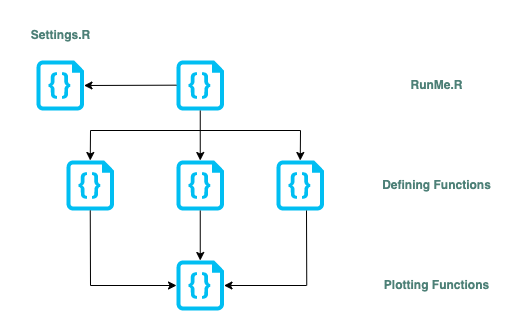
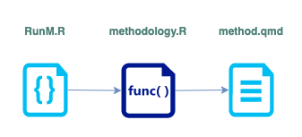

# 2022 LAC-GPP Country Reports

The present repository contains the R code used by the DAU to produce all the visualizations used by the 2022 LAC-GPP Country Reports. In order to prepare these VIZs, the DAU followed the specifications sent by the communications and design team (see the Inputs/full_specs.pdf file).

## Files description
In this repository you will find three main folders:

1. Code
2. Data
3. Outputs

The `Code` directory is where all the R scripts are stored with exception of the RunMe.R file. The `Data` directory contains the data to be used for the reports and the `Outputs` directory is where the VIZs outcomes are saved.

The data to be used in this project is a subset from the merged.dta file managed by the organization. The VIZs are stored in SVG format following this filing system: `COUNTRY_NAME/FIGURE_NUMBER/FILE_NAME.svg`

Due to the privacy discloures followed by the DAU (see the [DAU R Coding Handbook](https://ctoruno.quarto.pub/wjp-r-handbook/)), the contents of the `Data` and `Outputs` directories are limited on the GitHub repository and their full content can only be accessed through the WJP SharePoint.

## Code logic

The code is divided in three levels:

1. Upper level: A single file controls all the program and it is the `RunMe.R` script. This is a "_single-call_" file and it is designed to just be called along with a single argument that contains the abbreviated name of the country group that we would like to generate the figure for. Once that it is called, the script will start generating all the visualizations for each one of the countries within the group.

2. Defining Functions: The RunMe file will call several defining functions. One per figure or VIZ to generate. For example, to generate the SVG file for Figure 01 in the report, RunMe will call out the `figure01.fn()` function. These functions can be found in the `Code` directory inside their respective SECTION. For example, given that Figure 1 is in section 1 in the report. The defining function `figure01.fn()` can be found in the `Code/S01.R` file.

3. Plotting functions: The role of the defining functions is to define the data to be used in a specific figure. However, the plotting is performed by a plotting function. There is one plotting function per chart type. For example, all line charts in this report are plotted by `the LAC_lineChart()` function. Therefore, the same plotting function can be called by several different defining functions in order to generate the same type of chart. All the plotting functions are publicly available in this [GitHub repository](https://github.com/ctoruno/WJP-Data-Viz/tree/main/LAC).

There is an auxiliary file called `setting.R`. As its name could suggest, inside this file are all the pre-settings needed by the `RunMe.R` to perform smoothly. All the fonts, the ggplot theme, color palettes, and other related settings can be found here.



Additionally, the program will automatically produce a raw code chunk containing the HTML needed to display the Methodology section of each country in their respective online reports. A HTML template of this section is contained in the `method.qmd` file. Rendering this quarto file will produce a GitHub Flavored Markdown (GFM) file that contains the raw HTML code chunks needed to produce the Methodology page in the online country reports. 

However, given that some text segments of the outline change depending on the country in question, the quarto file needs to be called along with some pre-defined parameters containing the values that are unique for each country. For this, the `RunMe.R` will call the `methodology.R` script. The functions contained in this script are the ones responsible of asigning the parameters values for each country and, once all parameters are defined, the `methodology.R` script will render the `method.qmd` outline.

The resulting markdown file is saved in the Outputs folder of each country.



## How to use
As mentioned above, in order to generate all the plots needed, you just need to call the RunMe.R file with the country group name that you wish to generate the visualizations for.

There are six different groups:

1. **Andean Countries**: Pass the string "_andean_" as an argument to the call in order to generate the plots for Colombia, Ecuador, Bolivia and Peru.

2. **South Cone**: Pass the string "_south_" as an argument to the call in order to generate the plots for Brazil, Argentina and Paraguay.

3. **Western Caribbean and the Guianas**: Pass the string "_carib1_" as an argument to the call in order to generate the plots for Bahamas, Dominican Republic, Guyana, Haiti, Jamaica and Suriname.

4. **Eastern Caribbean**: Pass the string "_carib2_" as an argument to the call in order to generate the plots for  Antigua and Barbuda, Barbados, Dominica, Grenada, St. Kitts and Nevis, St. Lucia, St. Vincent and the Grenadines and Trinidad and Tobago.

5. **Central America**: Pass the string "_central_" as an argument to the call in order to generate the plots for Belize, Guatemala, Honduras, El Salvador, Costa Rica and Panama.

6. **USA**: Pass the string "_usa_" as an argument to the call in order to generate the plots for the USA.

In order to call the RunMe.R with the respective country group, open  your terminal and run the following lines:

```
$ cd PATH_TO_LOCAL_REPOSITORY
$ Rscript --vanilla RunMe.R "andean"
```

The script will run entirely and you will now have the final visualizations in the `Outcomes` directory, ordered by country and figure number. 

## Identified Issues

If you happen to find an error such as: 

```
ERROR: unnable to find quarto command line tools
```

It means that you haven't installed Quarto in your computer. Please check the [Get Started tab at quarto.org](https://quarto.org/docs/get-started/) in order to install Quarto in your local machine.

If you are having issues installing the `xlsx` package and you are running the code on a M1 Mac. Please check if the error originates because of it was not possible to load the `rJava` namespace:

```
Error: package or namespace load failed for ‘xlsx’: .onLoad failed in loadNamespace() for 'rJava'
```

If this is the case, please read [this thread](https://stackoverflow.com/questions/74893942/error-running-xlsx-and-rjava-on-mac-with-m1) on StackOverflow.

## Contact
For inqueries please contact _Carlos Toruño_ (ctoruno@worldjusticeproject.org) or _Santiago Pardo_ (spardo@worldjusticeproject.org). For general information, please contact _Ana María Montoya_ (amontoya@worldjusticeproject.org).
